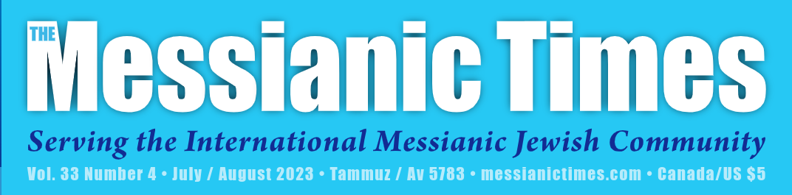

## Fully upgraded and refactored platform for **all** the [Times'](messianictimes.com) web services

### What steps were taken?

- **Rebuilt and re-branded** website with industry leading **NextJs** Framework ✔️
- Migrated CMS to **Sanity** from outdated and slow _WordPress_ ✔️
- Rebuilt managed subscription services like stripe and paypal✔️
- Created an email and telephone marketing service
- Created _easy, consistent, and scalable customization_ of their website/content in the future✔️
- Automated user interaction and contact

### What technology does it use?

  

Stripe, Paypal, Venmo, Mailgun, Constant Contact

and more...

## What's the process?

- **Start with research**
  - I use plenty of time to familiarize myself with the situation, context, and needs.
  - Learn about the tools that can be used to solve to problem
  - Ask people who know more to confirm my choices
  - Narrow it down to only the best
- **Work very close with the client**
  - Throughout the process it is essential to make sure that all decisions about tools to use and direction to take are correct before starting development.
  - Devise a plan _that will work for the client and myself_ before writing a single line of code
- **Take the time to:**
  - Create wire frames and diagrams
  - Verify all of the features that are expected/required
  - Create a project board and _use it_
- **Once again before writing code:**
  - Bring all of your resources to the client with a good and accurate presentation of the everything that is about to begin

  
<small>The code for the client project is not open source, _permission has been given to me to share this information_</small>
# MessianicTimesReadme
